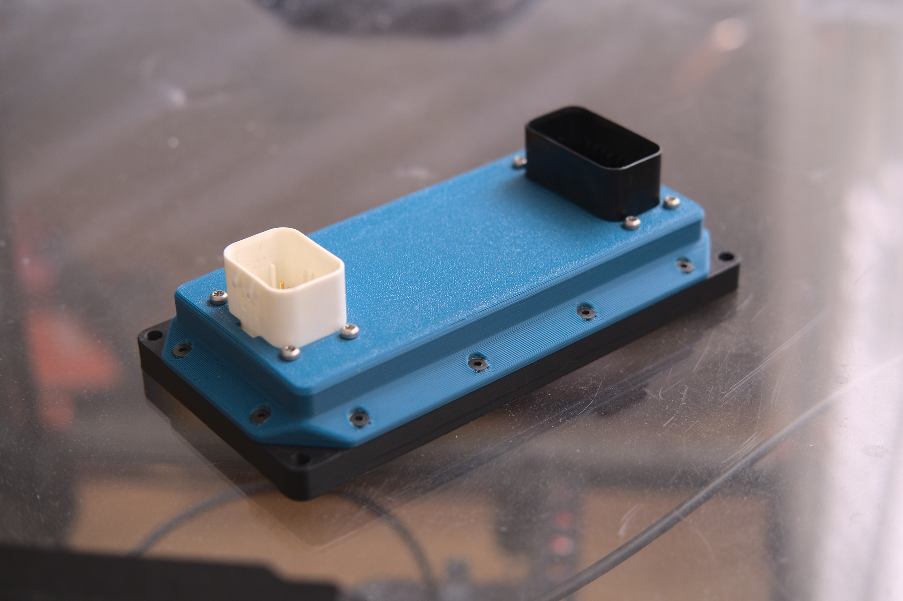

# Prius G2 Inverter controller

## About 

Inverter control board for Toyota Prius Gen 2 (XW20) inverter. 
Some of the schematics are based on Johannes Huebner's work found [here](https://github.com/jsphuebner/inverter-hardware).
Running [openinverter](http://www.openinverter.org) firmware.

    - ESP32 on board
    - AMPSEAL connectors
    - 3D printed enclosure

 
## Prerequisites 

ESP32 needs [ported webinterface](https://github.com/Bedz01/esp32-web-interface-port)
Get latest openinverter firmware [here](https://github.com/jsphuebner/stm32-sine/releases)

## Pinout 

Pinout is documented on the bottom silk of the PCB
